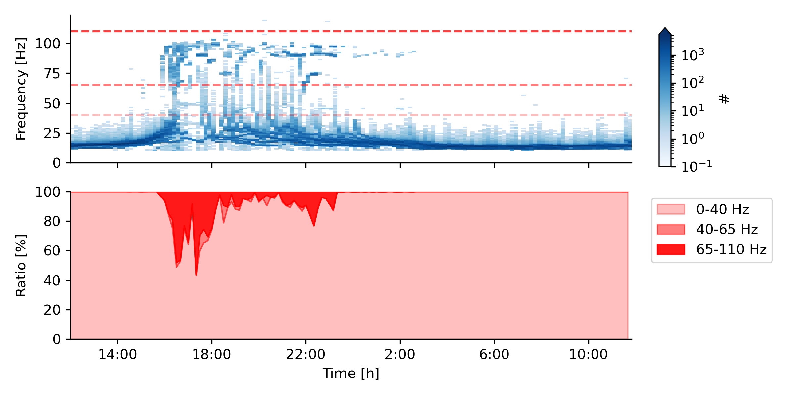

# pulsetracking
Pulsetracking is a module for tracking and plotting EOD activity from pulsefish recorded by an electrode grid.

For tracking pulsefish EODs and location see function get_clusters() in pulsetracking.pulsetracking. If the module is called from the command line, the code under __main__ is executed. Here, get_clusters() is called on a list of input files from multiple days of recording data.

For post-processing and plotting all EOD rate traces, see plot_traces() in pulsetracking.create_rate_traces. If the module is called from the command line, the code under __main__ is executed. Here, plot_traces() is called on a list of input files from multiple days of analysed recording data.

For plotting interesting sections of data, see pulsetracking.create_rate_traces. Plots generated by this file are shown here in the fig/ folder.

# Results

## EOD rate traces

### Resting fish
Two examples of EODr trackingg of resting fish on 2020-10-17 13:36 and 2020-10-18 07:16 resp.

### Active fish
Three examples of EODr tracking of active fish on 2020-10-17 22:03, 23:50 and 20:34 07:16 resp.

### Eel
Fish responding to electric eel activity by EOD arrest. EOD arrest is negatively correlated with distance to eel (DtE). Many examples like this can be found in the data. (recorded on 2019-10-17 20:44

### JAR
2019-10-20 21:19 - Two active fish swimming through the grid one goes downstream (x direction), and the other one goes downstream but then retreats. While the fish are near, one attenuates its EODr (JAR), and then goes back to its normal rate once retreated. --> the fish who lowers EODr keeps swimming downstream, the other fish retreats.

### Courting
2019-10-17 23:58 - One active fish approaching an inactive fish. Once they are near, the inactive fish start emitting many EODr rises (observably more and different nature than random rises). The active fish responds by emitting small EODr rises. The fish stay in proximity and emit coherent frequency rises throughout the night (not shown on the graph.). Only x-coordinate is plotted because both fish are on the edge of the grid and their y-coordinate does not vary. Plot could be extended by zooming in on the frequency rises. One should check if the short frequency rises are really there by examining raw data.

## EOD rate stats
### EODr distribution
This is a 2D histogram of the EOD rates found over all recording days (2019-10-17 to 2019-10-20). Sundown (16:30) to sunset (5:20) is marked by grey boxes. 

### Activity ratios
This is a 2D histogram of aggregated data for each 24hr period with EOD rate ratios for each point in time.

### fish movement
This is the fish location distribution as a function of EOD rate.

#### notes
- try adding a max_eps to OPTICS() in pulsetracking.analyse_window().
